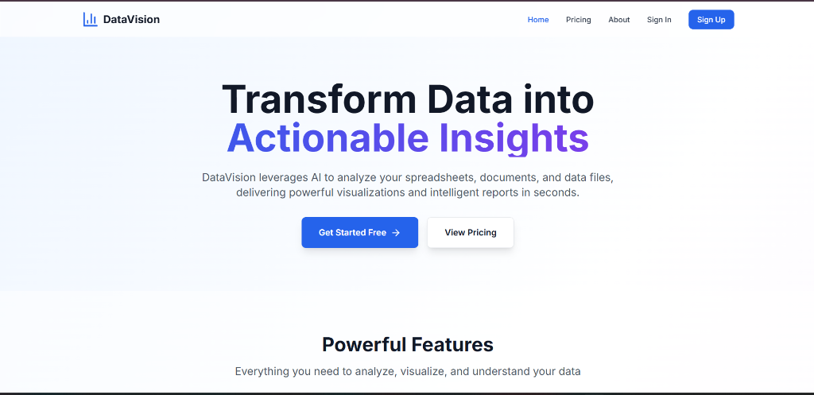
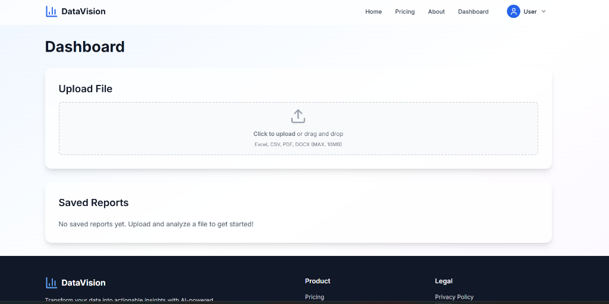
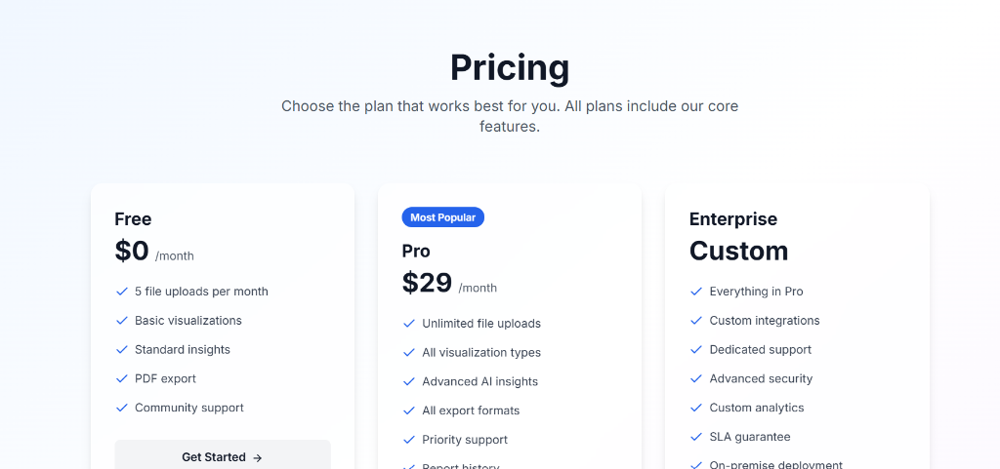

# 📊 DataVision AI — Intelligent Data Analysis & Visualization Platform

<div align="center">

[](https://nextjs.org/)
[](https://www.typescriptlang.org/)
[](https://tailwindcss.com/)
[](https://www.mongodb.com/)
[](https://next-auth.js.org/)
[](https://recharts.org/)
[](https://www.framer.com/motion/)
[](LICENSE)

<p align="center">
  <strong>Transform raw datasets and business documents into rich visualizations, statistical discoveries, and exportable executive reports in seconds.</strong>
</p>

[Explore Features](#-key-features) • [Screenshots](#-application-preview--screenshots) • [Architecture](#-architecture--tech-stack) • [Quick Start](#-quick-start-guide) • [API Reference](#-api-endpoints) • [Deployment](#-production-deployment)

</div>

---

## 📌 Project Overview

**DataVision** is a modern, full-stack data intelligence platform engineered to streamline exploratory data analysis (EDA), automated insights generation, and business reporting. Users can seamlessly upload tabular data (**Excel, CSV**) or unstructured documents (**PDF, DOCX**) to instantly extract data structures, uncover hidden trends and statistical anomalies, configure dynamic interactive charts, and export presentation-ready PDF or Word reports.

> 💡 **Background & Evolution**: Originally developed during tenure at Zidio Development (Aug–Sept 2025). The repository has been expanded and refined into a modular, production-grade Next.js 14 full-stack solution.

---

## 📸 Application Preview & Screenshots

<div align="center">

### 1. Landing & Product Overview
*Modern hero section highlighting DataVision's core capabilities, feature value propositions, and calls to action.*



---

### 2. Interactive Analysis Dashboard & File Upload
*Unified drag-and-drop ingestion interface supporting Excel, CSV, PDF, and DOCX (up to 10MB) alongside report history management.*



---

### 3. Flexible Pricing & Subscription Tiers
*Transparent tier breakdown ranging from Free exploratory access to Pro ($29/mo) and Enterprise solutions.*



</div>

---

## ✨ Key Features

| Feature | Description |
| :--- | :--- |
| 📁 **Multi-Format Ingestion** | Native support for `.xlsx`, `.xls`, `.csv` (client-side SheetJS) and `.pdf`, `.docx` (server-side parsers). |
| 🤖 **Automated Insights Engine** | Instant statistical profiling (mean, median, standard deviation, min/max ranges) with AI contextual synthesis. |
| 📈 **Trend & Anomaly Detection** | Sub-dataset partition analysis for upward/downward shifts and 2-sigma ($2\sigma$) statistical outlier identification. |
| 📊 **Dynamic Data Visualizations** | Interactive charts powered by Recharts (Bar, Line, Pie, Area, Radar) with configurable X/Y axes and auto-aggregation. |
| 📄 **Automated Report Builder** | Compiles executive summaries, key metrics, findings, and charts into structured reports saved to MongoDB. |
| 📥 **Multi-Format Export Suite** | One-click client-side export of charts and reports to **PDF** (via `jsPDF` + `html2canvas`), **Word (`.docx`)**, **PNG**, and **SVG**. |
| 🔐 **Enterprise-Grade Auth** | Secure credential authentication via NextAuth.js, bcrypt encryption (10 salt rounds), and JWT session persistence. |
| 🎨 **Modern Glassmorphic UI** | Responsive interface built with Tailwind CSS, Framer Motion micro-animations, and Lucide icons. |

---

## 🏗️ Architecture & Tech Stack

```mermaid
graph TD
    A[User / Browser] -->|Uploads CSV, XLSX, PDF, DOCX| B[Next.js 14 Client App]
    B -->|Client Parsing| C[SheetJS / CSV Parser]
    B -->|Server Parsing| D[/api/files/parse - pdf-parse & docx]
    C --> E[Normalized Tabular Data]
    D --> E
    E --> F[Statistical & AI Insights Engine]
    E --> G[Recharts Visualization Engine]
    F --> H[Executive Report Generator]
    G --> H
    H -->|Save Report| I[/api/reports Endpoint]
    I --> J[(MongoDB Atlas / Mongoose)]
    H -->|Client Export| K[Export to PDF / DOCX / PNG / SVG]
    A -->|Auth Login / Signup| L[NextAuth.js & bcrypt]
    L --> J
```

### Technology Breakdown

- **Core Framework**: [Next.js 14](https://nextjs.org/) (App Router, Server Actions, API Routes)
- **Language**: [TypeScript](https://www.typescriptlang.org/) (Strict typing across models, utils, and UI)
- **Styling & UI**: [Tailwind CSS](https://tailwindcss.com/), [Framer Motion](https://www.framer.com/motion/), [Lucide React](https://lucide.dev/)
- **Data Visualization**: [Recharts 2.12](https://recharts.org/)
- **Database & ODM**: [MongoDB](https://www.mongodb.com/) with [Mongoose 8.3](https://mongoosejs.com/) (Connection pooling & global caching)
- **Authentication**: [NextAuth.js 4](https://next-auth.js.org/) with JWT session strategy and protected route middleware
- **File Processors**:
  - `xlsx` (SheetJS) — Multi-sheet Excel & CSV parsing
  - `pdf-parse` — Stream parsing and text/table extraction
  - `docx` & `mammoth` — Document XML traversal and extraction
- **Export Engines**: `html2canvas`, `jspdf`, `docx` (Client-side execution)
- **AI / Insights**: Statistical analytics engine + OpenAI GPT API integration fallback

---

## 📂 Project Structure

```
datavision/
├── app/                              # Next.js 14 App Router
│   ├── about/page.tsx                # Company mission, team & about page
│   ├── api/                          # Backend API endpoints
│   │   ├── auth/                     # NextAuth & registration routes
│   │   │   ├── [...nextauth]/route.ts
│   │   │   └── signup/route.ts
│   │   └── reports/                  # Report CRUD endpoints
│   │       ├── route.ts              # GET / POST reports
│   │       └── [id]/route.ts         # GET / DELETE specific report
│   ├── auth/                         # Authentication views
│   │   ├── signin/page.tsx           # User login interface
│   │   └── signup/page.tsx           # User registration interface
│   ├── dashboard/                    # Core protected application
│   │   ├── page.tsx                  # Main upload, visualization & insights UI
│   │   └── reports/[id]/page.tsx     # Saved report viewer & exporter
│   ├── pricing/page.tsx              # Pricing plans & feature comparison
│   ├── privacy/page.tsx              # Privacy policy
│   ├── terms/page.tsx                # Terms of service
│   ├── globals.css                   # Global styles & Tailwind utilities
│   ├── layout.tsx                    # Global root layout & metadata
│   ├── page.tsx                      # Landing / Home page
│   └── providers.tsx                 # NextAuth SessionProvider wrapper
├── components/                       # Reusable React components
│   ├── charts/                       # Chart visualization modules
│   │   ├── AreaChart.tsx             # Recharts Area visualizer
│   │   ├── BarChart.tsx              # Recharts Bar visualizer
│   │   ├── LineChart.tsx             # Recharts Line visualizer
│   │   ├── PieChart.tsx              # Recharts Pie / Donut visualizer
│   │   └── RadarChart.tsx            # Recharts Radar visualizer
│   ├── Footer.tsx                    # Footer with navigation & social links
│   └── Navbar.tsx                    # Responsive navigation with session dropdown
├── docs/                             # Project documentation & media
│   └── screenshots/                  # High-resolution application previews
│       ├── dashboard-view.png
│       ├── landing-hero.png
│       └── pricing-plans.png
├── lib/                              # Core backend libraries & utilities
│   ├── models/                       # Mongoose database schemas
│   │   ├── Report.ts                 # Report schema & types
│   │   └── User.ts                   # User schema with bcrypt hooks
│   ├── utils/                        # Processing & analysis utilities
│   │   ├── dataParser.client.ts      # Client-side Excel & CSV parser
│   │   ├── dataParser.ts             # Server-side parser engine
│   │   ├── export.ts                 # PDF, DOCX, SVG, PNG export utilities
│   │   ├── insights.ts               # Statistical & AI insights generator
│   │   └── reportGenerator.ts        # Report builder & compiler
│   ├── auth.ts                       # NextAuth configuration & options
│   └── mongodb.ts                    # MongoDB connection caching layer
├── public/                           # Static public assets
│   ├── sample-data.csv               # Demo dataset for immediate testing
│   └── screenshots/                  # Public asset copies of UI previews
├── scripts/                          # Maintenance & setup scripts
│   └── seed.ts                       # Database seeding script (test user & demo reports)
├── types/                            # Global TypeScript declarations
├── middleware.ts                     # Route protection middleware for /dashboard
├── tailwind.config.ts                # Tailwind design system configuration
└── tsconfig.json                     # TypeScript compiler configuration
```

---

## 🗄️ Database Schema

### 1. User Model (`lib/models/User.ts`)

| Field | Type | Attributes | Description |
| :--- | :--- | :--- | :--- |
| `_id` | `ObjectId` | Primary Key | Auto-generated document ID |
| `name` | `String` | Required, Trimmed | Full display name (max 50 chars) |
| `email` | `String` | Required, Unique, Indexed | Lowercase user email |
| `password` | `String` | Required, `select: false` | Bcrypt hashed string (10 rounds) |
| `createdAt` | `Date` | Timestamp | Account creation timestamp |
| `updatedAt` | `Date` | Timestamp | Last account update timestamp |

### 2. Report Model (`lib/models/Report.ts`)

| Field | Type | Attributes | Description |
| :--- | :--- | :--- | :--- |
| `_id` | `ObjectId` | Primary Key | Auto-generated report ID |
| `userId` | `ObjectId` | Required, Indexed | Reference to the owning `User` |
| `title` | `String` | Required, Trimmed | Custom report title |
| `fileName` | `String` | Required | Original filename uploaded by user |
| `fileType` | `String` | Enum | `xlsx`, `xls`, `csv`, `pdf`, or `docx` |
| `data` | `Object` | Required | Normalized dataset containing `{ columns, rows }` |
| `insights` | `Object` | Nested | Summary, trends `[]`, anomalies `[]`, recommendations `[]` |
| `charts` | `Array` | Nested | Chart configurations (`type`, `data`, `config`) |
| `createdAt` | `Date` | Timestamp | Report creation date |
| `updatedAt` | `Date` | Timestamp | Last modified date |

---

## 🚀 Quick Start Guide

### Prerequisites

Ensure you have the following installed on your machine:
- **Node.js**: `v18.0.0` or higher
- **npm** (`v9+`), **yarn**, or **pnpm**
- **MongoDB**: Local MongoDB instance (`mongodb://localhost:27017`) or a free [MongoDB Atlas](https://www.mongodb.com/cloud/atlas) cluster

---

### Step 1: Clone the Repository

```bash
git clone https://github.com/Akhilkumar4464/DataVision-Ai.git
cd DataVision-Ai
```

### Step 2: Install Dependencies

```bash
npm install
```

### Step 3: Configure Environment Variables

Create a `.env.local` file in the project root directory:

```env
# Application Base URL
NEXTAUTH_URL=http://localhost:3000

# NextAuth Secret (Generate using openssl rand -base64 32)
NEXTAUTH_SECRET=your-secure-random-secret-key-here

# MongoDB Connection String
MONGODB_URI=mongodb://localhost:27017/datavision

# (Optional) OpenAI API Key for Enhanced Generative Insights
OPENAI_API_KEY=your-openai-api-key-here
```

> 🔐 **Generate a Secure Secret:**
> ```bash
> openssl rand -base64 32
> ```

### Step 4: Seed Database (Optional but Recommended)

Populate the database with a pre-configured test user and sample analytics data:

```bash
npm run seed
```

**Default Test Credentials:**
- **Email**: `test@example.com`
- **Password**: `password123`

### Step 5: Start the Development Server

```bash
npm run dev
```

Open your browser and navigate to **[http://localhost:3000](http://localhost:3000)**.

---

## 📊 File Format Specifications

| Format | Extensions | Engine | Parsing Strategy & Capabilities |
| :--- | :--- | :--- | :--- |
| **Excel** | `.xlsx`, `.xls` | SheetJS (`xlsx`) | Client-side direct parsing; extracts first sheet; preserves numbers and headers. |
| **CSV** | `.csv` | `csv-parser` | Auto-detects delimiters (comma, semicolon, tab); handles headers and records. |
| **PDF** | `.pdf` | `pdf-parse` | Server-side parsing; extracts tabular records, structural layout, and key figures. |
| **Word** | `.docx` | `docx` / XML | Server-side extraction; scans tabular data blocks and key metric summaries. |

*Maximum default upload size: **10 MB**.*

---

## 🔌 API Endpoints

### Authentication Routes

| Endpoint | Method | Access | Description |
| :--- | :--- | :--- | :--- |
| `/api/auth/signup` | `POST` | Public | Registers a new user account with hashed password. |
| `/api/auth/[...nextauth]` | `GET` / `POST` | Public | NextAuth session authentication, sign-in, and sign-out handlers. |

### Reports Routes

| Endpoint | Method | Access | Description |
| :--- | :--- | :--- | :--- |
| `/api/reports` | `GET` | Authenticated | Fetches all saved reports belonging to the authenticated user. |
| `/api/reports` | `POST` | Authenticated | Creates and stores a new report with insights and chart data. |
| `/api/reports/[id]` | `GET` | Authenticated | Retrieves a specific report by ID (verifying user ownership). |
| `/api/reports/[id]` | `DELETE` | Authenticated | Permanently removes a saved report. |

---

## 🌐 Production Deployment

### Option 1: Deploying to Vercel (Recommended)

1. Push your repository to [GitHub](https://github.com).
2. Connect your repository to [Vercel](https://vercel.com).
3. Under **Settings > Environment Variables**, configure:
   - `NEXTAUTH_URL` $\rightarrow$ `https://your-domain.vercel.app`
   - `NEXTAUTH_SECRET` $\rightarrow$ `[Your generated 32-byte secret]`
   - `MONGODB_URI` $\rightarrow$ `mongodb+srv://<username>:<password>@cluster.mongodb.net/datavision`
   - `OPENAI_API_KEY` $\rightarrow$ `[Your OpenAI Key - Optional]`
4. Click **Deploy**.

### Option 2: Self-Hosted / Node.js Server

```bash
# 1. Build the Next.js production bundle
npm run build

# 2. Start the optimized standalone server
npm run start
```

---

## 🛠️ Troubleshooting & FAQ

<details>
<summary><strong>1. MongoDB Connection Timeout (<code>MongooseError: Operation timed out</code>)</strong></summary>

- **Local MongoDB**: Verify the MongoDB daemon is active (`sudo systemctl status mongod` on Linux or `net start MongoDB` on Windows).
- **MongoDB Atlas**: Ensure your current IP is added to the IP Access List in Atlas Network Security (`0.0.0.0/0` for initial testing).
</details>

<details>
<summary><strong>2. NextAuth Secret Error (<code>Missing NEXTAUTH_SECRET</code>)</strong></summary>

Ensure you have created a `.env.local` file containing `NEXTAUTH_SECRET`. In production, set this environment variable in your hosting provider's settings.
</details>

<details>
<summary><strong>3. Port 3000 Already in Use</strong></summary>

- **Windows**:
  ```bash
  netstat -ano | findstr :3000
  taskkill /PID <PID> /F
  ```
- **macOS / Linux**:
  ```bash
  lsof -ti:3000 | xargs kill -9
  ```
- Or run on an alternative port: `npm run dev -- -p 3001`
</details>

---

## 🗺️ Roadmap

- [x] Multi-format parsing (Excel, CSV, PDF, DOCX)
- [x] Statistical heuristics and anomaly detection ($2\sigma$)
- [x] Multi-format export (PDF, Word DOCX, SVG, PNG)
- [x] NextAuth user authentication & report history
- [ ] SQL Database direct connection (PostgreSQL, MySQL, Snowflake)
- [ ] Multi-LLM provider support (Anthropic Claude, Google Gemini, Ollama)
- [ ] Collaborative team workspaces and shared dashboard links
- [ ] Automated scheduled email report digests

---

## 🤝 Contributing

Contributions, issues, and feature requests are welcome!

1. Fork the Project
2. Create your Feature Branch (`git checkout -b feature/AmazingFeature`)
3. Commit your Changes (`git commit -m 'Add some AmazingFeature'`)
4. Push to the Branch (`git push origin feature/AmazingFeature`)
5. Open a Pull Request

---

## 📄 License

This project is licensed under the **MIT License** — see the [LICENSE](LICENSE) file for details.

<div align="center">
  <sub>Built with ❤️ by Akhil Kumar & the DataVision Team</sub>
</div>
